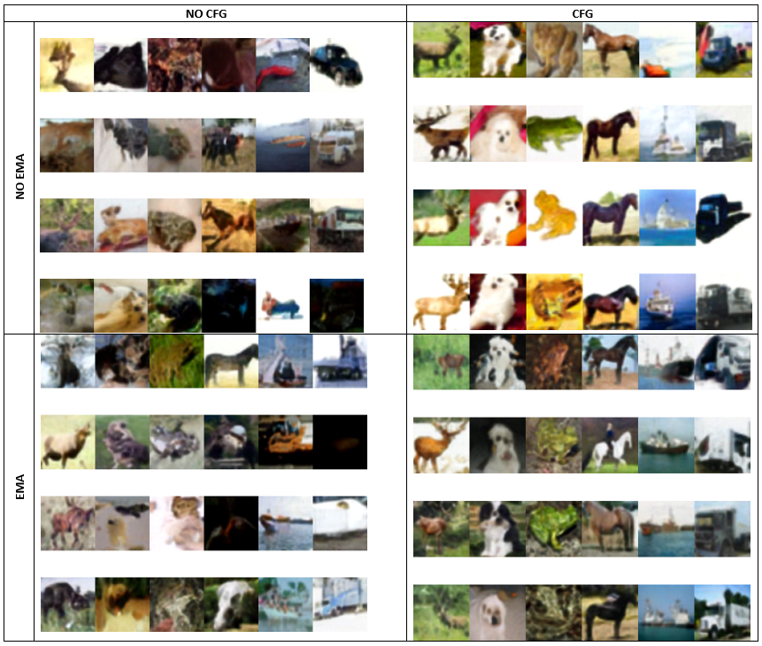

# DDPMs

In this homework you are going to learn how to implement DDPMs from scratch. First, you will implement an unconditional model and then a classifier-free guidance model (CFG). Answer questions with 🤗 and upload them as Lastname_DDPM.pdf 

## Point 1 (Unconditional) {2.5} [1]
### Forward Process

**Assuming you have PyTorch installed:**
**Require:** `pip install -q -U einops datasets matplotlib tqdm`

- Fill TODO in line 455 to define the cosine beta schedule.
- **Explain the function of the beta schedule.** 🤗 {0.3125}
- Fill TODO in line 506 to define the posterior. **(Explain what is the posterior).** 🤗 In 556 define the initial random noise and in 563 define the output of the forward process function. {0.3125}
- Use the plot function (line 582) to plot the forward process with each one of the 4 schedules. **Explain the possible advantages and disadvantages of using each one when training your DDPM.** 🤗 {0.3125}
- Plot Beta vs timestep and sqrt(1-beta) vs timestep (line 611). You may want to plot the cosine schedule in a separate graph. **What does sqrt(1-beta) represent?** 🤗 {0.3125}

### Training and sampling

- Fill TODO in lines 750 and 758 to complete Sampling
- Human quality perception: Do at least 7 experiments, changing the 4 schedules and 3 loss types. Feel free to experiment with other parameters as optimizer, number of timesteps and epochs as well. Examine the loss and observe the original images from Fashion MNIST to analyze the overall quality of the generated images with each experiment. Keep in mind that the dataset you trained on is pretty low-resolution (28x28). **Present an analyze your results.** 🤗 {1.25}
- Create a gif of the denoising process for a random sample (line 876).

## Point 2 (CFG) {2.5} [2]

**a. Download datasets:**
  To download a dataset from Kaggle using Python, you can use the Kaggle API. Here are the steps to download the datasets:
  1. **Install the Kaggle API package:**
     If you haven't already, you need to install the Kaggle API package using pip. Open your command prompt or terminal and run the following command:
     ```
     pip install Kaggle
     ```
  2. **Get your Kaggle API credentials:**
     To use the Kaggle API, you'll need to create an API token on Kaggle and download the credentials file. You can do this by following these steps:
     
     a. Log in to your Kaggle account.
     
     b. Go to your account settings by clicking on your profile picture and selecting "Account."
     
     c. Scroll down to the "API" section and click on the "Create New API Token" button.
     
     d. You can also access it at https://www.kaggle.com/settings/account.
     
     e. This will download a file named kaggle.json. Keep this file secure, as it contains your API credentials.
     
  4. **Configure the Kaggle API:**
     Before you can use the Kaggle API, you need to configure it with your API credentials. Place the kaggle.json file in the ~/.kaggle/ directory on your machine. If the directory doesn't exist, you can create it.
  5. **Download the datasets:**
     Run the download_datasets.py script. Make sure cifar10 and landscape_img_folder are downloaded at the same level of the scripts. 

**b. Understand Conditional Image Generation:**
Since you became familiar with unconditional image generation in point 1, understanding the code in ddpm.py should be easier, as they are very similar. However, in this point, you are not required to develop anything in this script, just understand it and run it to observe the sampled landscape images. 

Your task is to fill the TODOs in ddpm_conditional.py and modules.py in order to implement classifier-free guidance for image generation based on labels. To do so, here are some suggested steps:

- **i. Modify the UNet to be conditioned on label embeddings. Fill TODOs in class UNet_conditional in modules.py (215, 232):**
  - **What are the dimensions of the label embeddings? Are these the same as the dimensions for time embeddings?** 🤗 {0.25}

- **ii. Modify the train loop (TODOs in train loop in ddpm_conditional.py, 89-94).** {0.25}

- **iii. Modify the sampling loop in ddpm_conditional.py:**
  1. Add CFG (51). Explain how CFG works [Read the paper](https://arxiv.org/pdf/2207.12598.pdf). **And explain how CFG is originally proposed in this paper VS how you implement it in line 51.** 🤗 {0.5}

- **iv. Exponential moving average (EMA) is already implemented in modules.py. Explain this code (7-32) and answer what is EMA and why is it important for the model?** 🤗 {0.5}

**c. Model Training:**
If you want, you can train your own models to experiment with the hyperparameters. However, you should download the checkpoints trained with the default parameters in the launch function [here](https://drive.google.com/drive/folders/1beUSI-edO98i6J9pDR67BKGCfkzUL5DX). Create a folder named checkpoints at the scripts level to store them. Use these checkpoints to make a comparison between NO EMA and NO CFG (i.e., CFG=0); EMA and NO CFG; CFG and NO EMA; CFG and EMA. For example:



Observe the original images from Fashion CIFAR-10. **Discuss the influence of EMA and CFG in the overall quality of the generated images.** 🤗 {1.0}

## Bonus {0.5} 

Empirically, [Ho et al. (2020)](https://arxiv.org/abs/2006.11239) found that suing a simplified objective that ignores the weighting term to train the diffusion model works better. 


## References

[1] [The Annotated Diffusion Model](https://github.com/dome272/Diffusion-Models-pytorch/blob/main/README.md)

[2] [Diffusion-Models-pytorch](https://huggingface.co/blog/annotated-diffusion)


